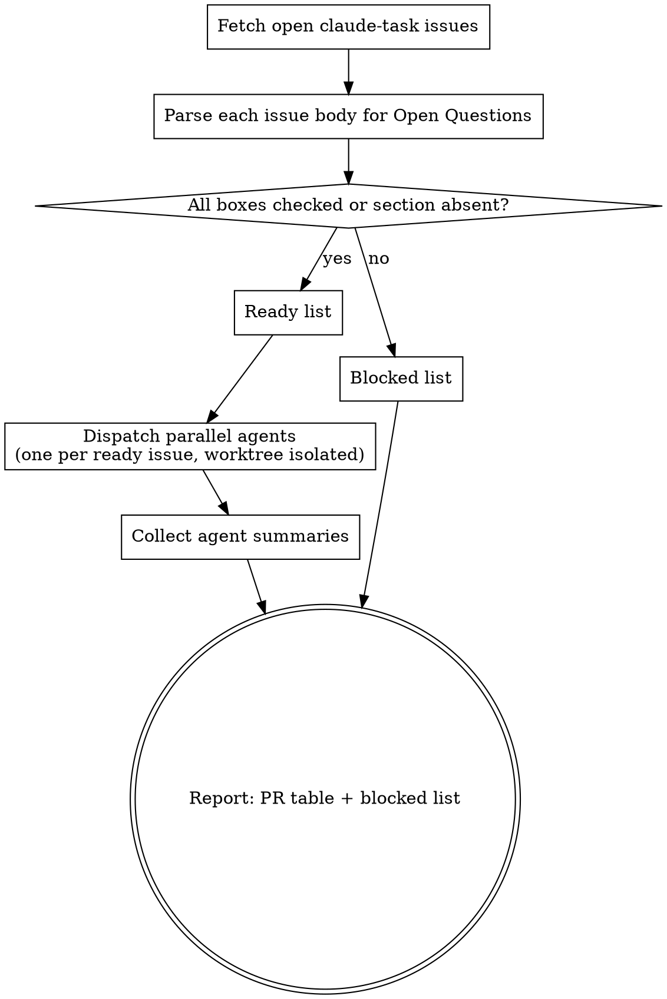

# Resolving `claude-task` Issues

## Overview

Fetch open GitHub issues labeled `claude-task` on the current repo, check each body for unanswered `## Open Questions`, and dispatch one isolated subagent per **ready** issue to produce a PR. Blocked issues are reported back to the user with their unchecked questions listed verbatim.

**Core principle:** Never implement a blocked issue. If an `## Open Questions` section has any `- [ ]` remaining, the human has not committed to a decision yet — report it as blocked and move on to the next one.

## When to Use

- "work on the open claude-task issues"
- "resolve any claude-task issue"
- "pick up the claude-task issues"
- "check open issues and implement any marked as claude-task"
- "see what's ready for me and fix it"

Do NOT use to implement issues that are not labeled `claude-task`, even if they look simple. The label is a deliberate contract from `authoring-claude-task-issues`.

## Workflow



## Step 1 — Fetch

```bash
gh issue list --state open --label claude-task \
  --json number,title,body,labels,url,comments
```

If the command returns `[]`, tell the user "no open claude-task issues" and stop.

If `gh` fails with `error connecting to api.github.com`, retry after ~1 second. Retry up to 3 times before surfacing the error.

Also run `git fetch origin` once at the start so your local view of branches/PRs is fresh. **Never assume stale local git state is correct.**

## Step 2 — Parse `## Open Questions`

For each issue body, look for an `## Open Questions` heading.

- **No such heading** → ready.
- **Heading found** → walk the top-level bullets immediately under it until the next `## ` heading:
  - Every top-level bullet starting with `- [ ]` means **unanswered** → issue is **blocked**.
  - Every top-level bullet starting with `- [x]` is answered. The rest of the bullet line is the question; any indented sub-bullets or indented prose lines beneath it form the answer.
  - **Any single `- [ ]`** means the issue is **blocked**.

**Do not parse issue comments to determine readiness.** Comments are discussion, not decisions. The issue body's `## Open Questions` section is the sole decision record. However, comments ARE passed to the dispatched agent as context in Step 3.

### Parsing reference (shell)

Check readiness (exit 0 = ready, non-zero = blocked):

```bash
awk '
  /^## Open Questions/   { in_section=1; next }
  /^## / && in_section   { exit blocked }
  in_section && /^- \[ \]/ { blocked=1 }
  END                    { exit blocked }
'
```

List unchecked questions from a blocked issue:

```bash
awk '
  /^## Open Questions/   { in_section=1; next }
  /^## / && in_section   { exit }
  in_section && /^- \[ \]/ { print }
'
```

Pipe the output of `gh issue view <n> --json body --jq .body` into either.

## Step 3 — Dispatch (Ready Issues Only)

For each ready issue, call the `Agent` tool with:

- `subagent_type: "general-purpose"`
- `isolation: "worktree"` — **mandatory** for parallel safety
- Custom prompt built from the template below

**All dispatches go in a single message with multiple tool calls** so they run concurrently. See `superpowers:dispatching-parallel-agents` for the underlying pattern.

### Agent prompt template

```
You are working in an isolated git worktree of the `<owner>/<repo>` repo.
Your task is to resolve GitHub issue #<N>.

## Issue #<N>: <title>

<full issue body, verbatim>

## Discussion context (from issue comments, not authoritative)

<verbatim comments oldest-first, or "No comments." if none>

## Repo context

- Main branch: `<master | main>` — branch off it.
- Commit message convention: run `git log --oneline -10` and match the
  prefix style you see (conventional commits: feat:, fix:, chore:, etc.).
- Git identity is preconfigured. Do not change it.

## Deliverable

1. Create a branch off the main branch with a descriptive name
   (e.g. `fix/issue-<N>-<short-slug>`).
2. Implement the issue's Scope. Respect its "Out of scope" section.
3. Run the repo's build and test commands until green
   (e.g. `go build ./... && go test ./...`).
4. Commit with a message ending in:

       Co-Authored-By: Claude Opus 4.6 (1M context) <noreply@anthropic.com>

5. Push the branch to `origin`.
6. Open a PR:

       gh pr create --base <main> --head <branch> \
         --title "<type>: <summary>" \
         --label claude-task <plus each label inherited from the issue> \
         --body "<body with 'Closes #<N>' near the top>"

   The `claude-task` label on the PR is MANDATORY — it preserves
   traceability from issue to PR. Labels inherited from the issue
   (bug, enhancement, ci, etc.) should also be applied.

7. If `gh pr create` fails with `error connecting to api.github.com`,
   retry after ~1 second up to 3 attempts. Do NOT fall back to browser
   URLs — retrying virtually always works for this transient flap.

## Constraints

- Do not modify files outside the issue's declared scope.
- Do not refactor unrelated code.
- Do not skip tests to ship faster.
- If the issue turns out to need human input you did not expect, STOP,
  do not commit, and return a "needs clarification" summary listing the
  specific questions.

## Return

A concise summary (under 400 words) containing:
- Files changed
- Key design decisions (if any)
- Test results
- The PR URL
- Anything you deliberately skipped and why
```

**Isolation is not optional.** Without `isolation: "worktree"`, parallel agents will stomp on each other's working copies. Include it on every dispatch.

## Step 4 — Collect and Report

After all dispatched agents return:

1. **Ready issues → PRs table:**

   | Issue | Branch | PR | Status |
   |---|---|---|---|
   | #42 | fix/issue-42-retry-rollback | #48 | opened |
   | #43 | test/issue-43-picker-coverage | #49 | opened |

2. **Blocked issues:** for each, list the unchecked questions so the user knows exactly what to answer:

   > **#44 blocked on 2 open questions:**
   > - Should compare mode share history or branch?
   > - How does `/model` interact with compare mode?

3. **Agent failures:** if any agent returned without opening a PR (e.g., it ran into a DNS wall after 3 retries, or stopped with a "needs clarification" summary), surface the branch name and what it produced so the user can finish the job or respond to the question.

4. **Stale worktrees:** note each worktree path so the user can `git worktree remove` them after PRs merge. Do NOT remove them automatically; the user may want to inspect.

## Quick Reference

| Step | What | Command / Tool |
|---|---|---|
| 0 | Refresh local state | `git fetch origin` |
| 1 | Fetch open claude-task issues | `gh issue list --state open --label claude-task --json number,title,body,labels,url,comments` |
| 2 | Parse readiness | `awk` snippet above, or manual scan |
| 3 | Dispatch ready issues | `Agent` tool, `isolation: "worktree"`, all in one message |
| 4 | PR label enforcement | Agents must use `gh pr create --label claude-task ...` |
| 5 | Network resilience | Retry `gh` up to 3× on `error connecting to api.github.com` |
| 6 | Report | PR table + blocked list + worktree paths |

## Common Mistakes

- **Dispatching a blocked issue because "the questions look easy to answer yourself."** The `- [ ]` state is the human's contract: they have not committed. Report as blocked and move on.
- **Dispatching sequentially when issues are independent.** Multiple independent issues should run concurrently. A single message containing multiple `Agent` tool calls is the mechanism.
- **Forgetting `isolation: "worktree"`.** Parallel agents will trample each other without isolation.
- **Letting the agent open a PR without `--label claude-task`.** Breaks issue→PR traceability. This label on the PR is mandatory.
- **Parsing issue comments to determine readiness.** Only the issue body's `## Open Questions` section counts. Comments are context, not decisions.
- **Giving up on the first `gh` DNS-flap error.** Retry up to 3 times.
- **Assuming stale local git state is correct.** Always `git fetch origin` before deciding anything about branch or PR state. State on disk can lag behind reality.
- **Not reporting blocked issues back to the user.** The whole point of gating is to tell the human what to answer. Silent skipping is a failure mode.

## Red Flags — STOP and reconsider

- About to dispatch an issue with a `- [ ]` remaining → STOP, report as blocked
- About to call `Agent` without `isolation: "worktree"` → add it
- About to dispatch sequentially when issues are independent → batch into one message
- About to "just take a look myself" instead of dispatching → that is a sign the issue is not `claude-task`-ready; either report it as blocked or ask the user whether the label was applied correctly

## See Also

- **`authoring-claude-task-issues`** — the companion skill that creates issues in the format this skill consumes. The `## Open Questions` convention is defined there.
- **`superpowers:dispatching-parallel-agents`** — the foundational pattern for parallel subagent dispatch. This skill is a domain-specific specialization that adds GitHub-issue-driven gating and PR-label enforcement on top of that pattern.
